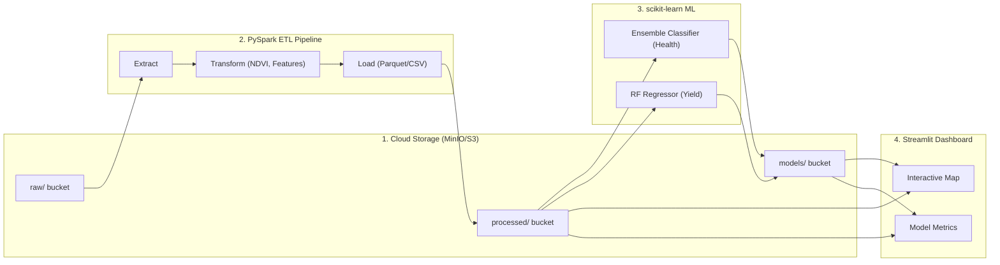

# AgriSatAI 🌾

[](https://agrisatai.streamlit.app/)
[](https://www.python.org/)
[](https://spark.apache.org/)
[](https://min.io/)
[](https://scikit-learn.org/)
[](https://opensource.org/licenses/MIT)

AgriSatAI is a distributed ETL pipeline and predictive analytics platform for agriculture. It processes multi-spectral satellite imagery and weather data to predict crop health and forecast yields using ensemble machine learning models. 

**Live App**: [agrisatai.streamlit.app](https://agrisatai.streamlit.app/)

---

## 🏗️ Architecture



## 🚀 Key Features

- **Distributed Data Processing**: Uses PySpark to process raw multi-spectral GeoTIFF satellite data, calculate NDVI/EVI, and engineer features at scale.
- **Ensemble Machine Learning**: Achieves high accuracy (>90%) on crop health classification using a soft-voting ensemble of Random Forest, Gradient Boosting, and SVM models.
- **S3-Compatible Cloud Storage**: Integrates `boto3` to store raw data, processed Parquet files, and serialized models in MinIO (drop-in replacement for AWS S3).
- **Interactive Dashboard**: A full-stack Streamlit app featuring Folium geospatial maps, Pipeline DAG visualizations, and real-time inference simulators.
- **Performance Profiling**: Built-in runtime decorators to benchmark Spark's distributed processing against single-threaded Pandas execution.

---

## 💻 Installation & Setup

1. **Clone the Repository**:
   ```bash
   git clone https://github.com/TechieSamosa/AgriSatAI.git
   cd AgriSatAI
   ```

2. **Set Up Python Environment**:
   ```bash
   python -m venv .venv
   .\.venv\Scripts\activate  # Windows
   source .venv/bin/activate # Mac/Linux
   pip install -r requirements.txt
   ```

3. **Start MinIO Storage (Optional)**:
   *Ensure Docker Desktop is running, then execute:*
   ```bash
   docker-compose up -d
   ```

---

## 🛠️ Running the Pipeline

Run the following commands sequentially to execute the full data engineering and ML pipeline:

### 1. Generate Synthetic Data
Generates 4-band (Red, Green, Blue, NIR) synthetic GeoTIFF files simulating satellite imagery.
```bash
python scripts/generate_data.py
```

### 2. Run the PySpark ETL
Extracts the raw imagery, calculates NDVI, handles missing data, and writes to Parquet.
```bash
python scripts/run_etl.py
```

### 3. Train the ML Models
Trains the ensemble classifier and yield regressor, saving the artifacts to disk.
```bash
python scripts/run_training.py
```

### 4. Launch the Dashboard
Open the interactive Streamlit dashboard to view the map, pipeline DAG, and predictions.
```bash
streamlit run src/dashboard/app.py
```

---

## 📊 Dashboard Views
1. **Overview & Map**: KPI metrics and interactive Folium field map with health statuses.
2. **Pipeline & Data Quality**: Sankey diagram of the ETL DAG, data completeness scores, and PySpark profiling benchmarks.
3. **Predictive Models**: Live sliders to simulate field conditions and output real-time predictions.
4. **Seasonal Trends & Alerts**: Alert system for critically stressed fields and NDVI growth trends.

---

## 🤝 Contributing
Contributions are welcome! Please open an issue or submit a pull request for new features, bug fixes, or optimizations.

## 📜 License
This project is licensed under the MIT License. See the [LICENSE](LICENSE) file for details.
